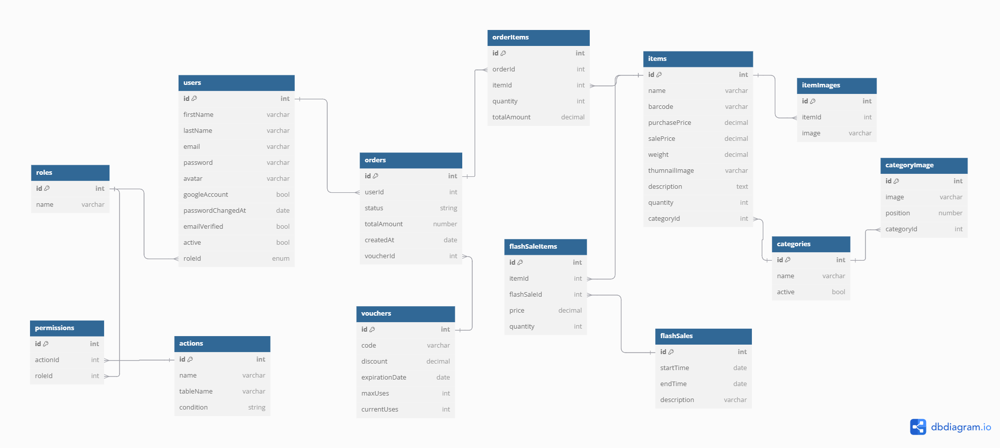

# NestShopify
    
## Overview
An e-commerce website sells products directly to users, offering easy browsing, secure payments, and home delivery, making shopping convenient and accessible from any device.

## Technology Using
- Back End: NodeJS, NestJS, Typescript
- Database: PostgreSQL, Redis
- Architectural Pattern: Controller-Service-Repository

## Key Features
- Authentication and Authorization:
    - Using ACL for authorization
    - Users can sign up, log in
    - Users can login with social account such as google
    - Users need to verify their email when registering to ensure they own the email address.
- Roles
    - The default role is admin, customer
    - admin can get, create, delete, or change user role
- Permissions
    - Admin can get all, create, or delete permissions for the role
- Categories 
    - CRUD category 
    - Sort banner images by position and category 
    - Category have status active or inactive
- Items
    - CRUD Items
    - Item include name, barcode, purchase price, sale price, weight, thumbnail image, description, quantity, category
    - Item can have many images
    - decrease the number of items in stock when the user purchases success
- Orders
    - CRUD orders
    - Can see report sales orders by month and year
- Vouchers
    - Can be used for orders
    - Have limited by time and quantity
- FlashSale
    - Manage time for flash sale
    - Manage price items during flash sale time
    - Can see how many items are in flash sale
- Notification
    - An email will be sent to users 15 minutes before the flash sale starts.


## Database Design


## Setting Up Your Local Environment 
- File `.env` located in the client folder
```
REACT_APP_CLIENT_URL=your client link
REACT_APP_SERVER_URL=your server link 
REACT_APP_GOOGLE_CLIENT_ID=your google id
```

- File `config.env` located in the server folder

```
GOOGLE_CLIENT_ID=your google id
GOOGLE_CLIENT_SECRET=your secret google id

# DATABASE
DB_TYPE=
DB_HOST=
DB_PORT=
DB_USERNAME=
DB_PASSWORD=
DB_DATABASE=

# REDIS
REDIS_HOST=
REDIS_PORT=

# JWT
JWT_SECRET=your JSON web token secret (I recommend string with at least 32 characters for Security)

# mail
EMAIL_HOST=
EMAIL_PORT=
EMAIL_USERNAME=
EMAIL_PASSWORD=

#server
SERVER_URL=

#server store image
IMGBB_API_KEY=

#Use to increase app performance
CLUSTER_MODE=true|false

```
## About the Author

Hi, I'm the creator and maintainer of this project. I'm passionate about software development and always eager to improve. If you find this project helpful, please consider giving it a star ⭐ – your support means a lot!  

If you encounter any bugs or issues, feel free to report them via email. I appreciate your feedback!  

📧 **Email:** naruto3285@gmail.com

If you want to learn more about this project API, you can visit this link.
<a href="https://documenter.getpostman.com/view/19507372/2sA3kbfHgq#186c0ec4-0ef7-4976-ab7c-4360295bde63">nestshopify</a>
